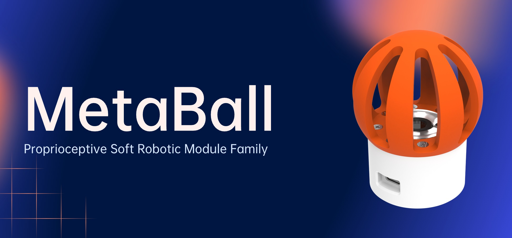
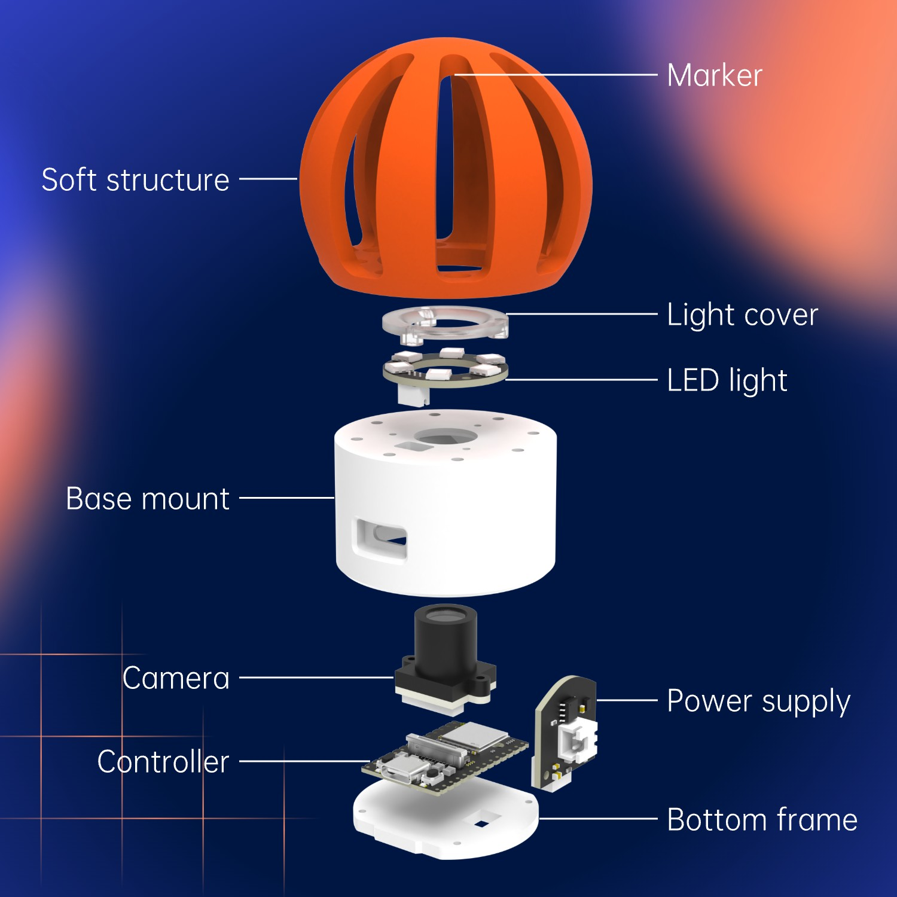
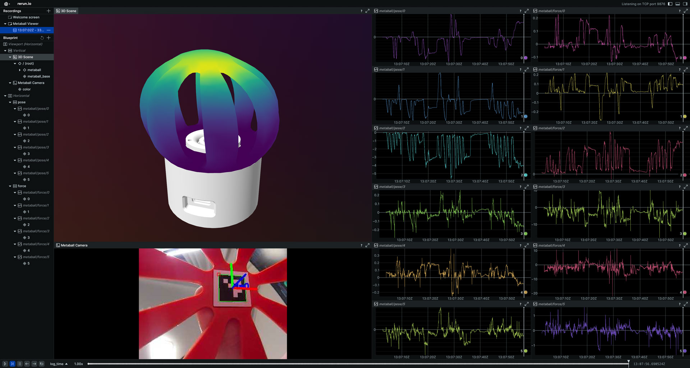

<h1 align="center">MetaBall</h1>

<p align="center">
  <a href="https://www.python.org/"></a>
  <a href="https://pytorch.org/"></a>
  <a href="https://www.3ds.com/products/simulia/abaqus/"></a>
  <a href="https://opencv.org/"></a>
  <a href="LICENSE"></a>
  <br/>
  <a href="./docs/training.ipynb">⚡Training Guide</a> |
  <a href="./docs/assembly.md">🤖Assembly Guide</a> |
  <a href="https://github.com/han-xudong/metaball-viewer">🫧Data Viewer</a> |
  <a href="https://a360.co/4ePH4PC">🧩CAD Files</a>
</p>
<p align="center">
  
</p>

MetaBall is a soft end-of-robot module capable of vision-based deformable perception. It is designed to provide a wide range of motion and sensing capabilities, making it suitable for various applications in robotics, including manipulation, exploration, and human-robot interaction. MetaBall is part of the [Proprioceptive Soft Robotic Modules (ProSoRo)](https://prosoro.github.io) family.

## 📦 Installation

Clone this repository:

```bash
git clone https://github.com/han-xudong/metaball.git
```

We use `uv` to manage Python dependencies. See [uv documentation](https://docs.astral.sh/uv/getting-started/installation/) for installation instructions. Once `uv` is installed, run the following command to set up the environment:

```bash
uv sync
uv pip install -e .
```

## ⚡ Training

Before training the model, you need to prepare the dataset according to the [training guide](./docs/training.ipynb).

Then, run the following command to train the model:

```bash
uv run python scripts/train.py [options]
```

There are several configurable options for training:

| Options               | Description                                       | Type   | Default               |
|-----------------------|---------------------------------------------------|--------|-----------------------|
| --batch-size          | Batch size for training.                          | int    | 128                   |
| --lr                  | Learning rate for the optimizer.                  | float  | 1e-5                  |
| --max-epochs          | Maximum number of training epochs.                | int    | 2000                  |
| --save-dir            | Directory to save training logs and checkpoints.  | str    | lightning_logs        |
|--data.dataset-path    | Path to the dataset directory.                    | str    | ./data/metaball/sim   |
|--data.num-workers     | Number of workers for data loading.               | int    | 4                     |
|--data.pin-memory      | Whether to pin memory during data loading.        | bool   | False                 |
|--data.train-val-split | Train-validation split ratios.                    | tuple  | 0.875 0.125           |
|--model.name           | Model name                                        | str    | BallNet               |
|--model.x-dim          | Input dimension                                   | tuple  | 6                     |
|--model.y-dim          | Output dimension                                  | tuple  | 6 2586                |
|--model.h1-dim         | Hidden layer 1 dimension                          | tuple  | 128 1024              |
|--model.h2-dim         | Hidden layer 2 dimension                          | tuple  | 128 1024              |

You can also follow the [training guide](./docs/training.ipynb) to test the model by calculating the R2 score, and RMSE, and visualizing the prediction results, etc.

## 🤖 Hardware

The MetaBall hardware mainly consists of a camera, a controller board, a power board, an LED light board, a soft struture and several 3D-printed parts. The camera is used for capturing images, while the controller board publishes the images through TCP protocol. The power board supports 6-36V input and powers the controller board. The LED light board provides illumination for the camera. The soft struture is made of polyurethane (PU), which is the main part to interact with the environment. 3D-printed parts are used to assemble the camera, controller board, and power board together.

<p align="center">
  
</p>

CAD files of the MetaBall are available on [Fusion](https://a360.co/4ePH4PC). Please refer to the [assembly guide](./docs/assembly.md) for more details on how to assemble the MetaBall.

## 🚀 Deployment

After connecting the Omni-Neck to the computer and modifying the configuration, you can deploy it by running the following command:

```bash
uv run metaball [options]
```

Various configuration options are available:

| Options       | Description                                   | Type   | Default                          |
|---------------|-----------------------------------------------|--------|----------------------------------|
| --host        | Host address for the publisher.               | str    | 127.0.0.1                        |
| --port        | Port number for the publisher.                | int    | 6666                             |
| --camera-yaml | Path to the camera configuration YAML file.   | str    | ./configs/maixcam-xxxx.yaml      |
| --onnx-path   | Path to the ONNX model file.                  | str    | ./models/BallNet.onnx            |

All data, including images, poses, forces, and node displacements, will be published through TCP (ZeroMQ + Protocol Buffers) in the following format:

```protobuf
package Metaball;

message Metaball
{
    double timestamp = 1;
    bytes img = 2;
    repeated double pose = 3;
    repeated double force = 4;
    repeated double node = 5;
}
```

They can be visualized through the [MetaBall Viewer](https://github.com/han-xudong/metaball-viewer).



## 📄 License

This project is licensed under the [MIT License](LICENSE).

## 🔗 Citation

If you find this project useful in your research, please consider citing:

```bibtex
@article{han2025anchoring,
    title={Anchoring Morphological Representations Unlocks Latent Proprioception in Soft Robots},
    author={Han, Xudong and Guo, Ning and Xu, Ronghan and Wan, Fang and Song, Chaoyang},
    journal={Advanced Intelligent Systems},
    volume={7},
    pages={e202500444},
    year={2025}
}
```
