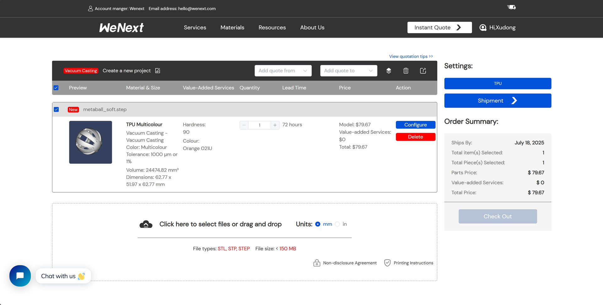
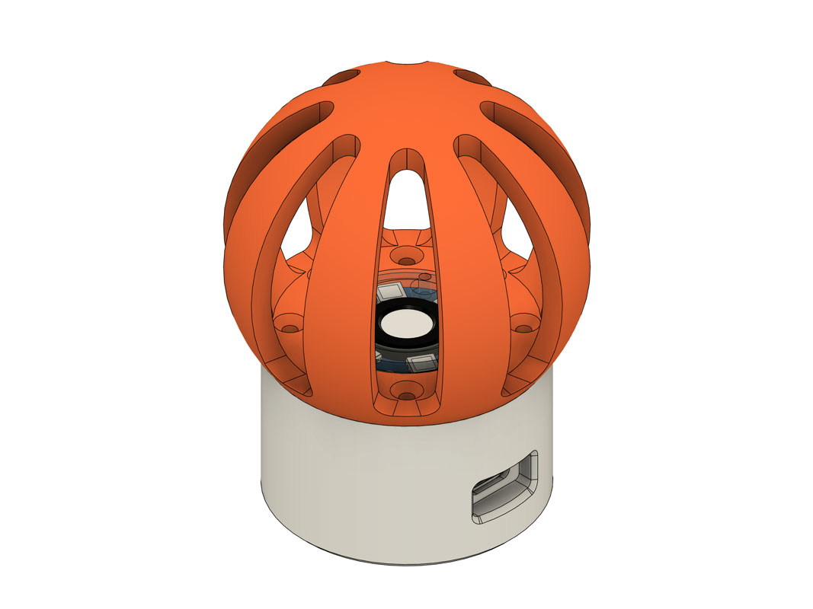
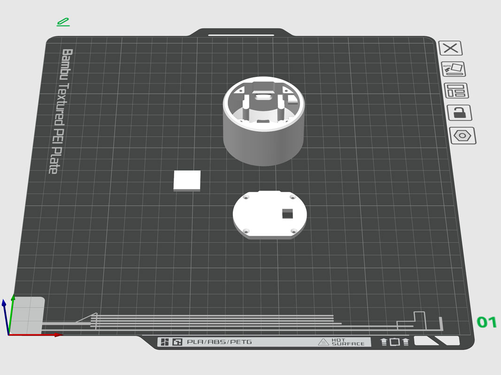
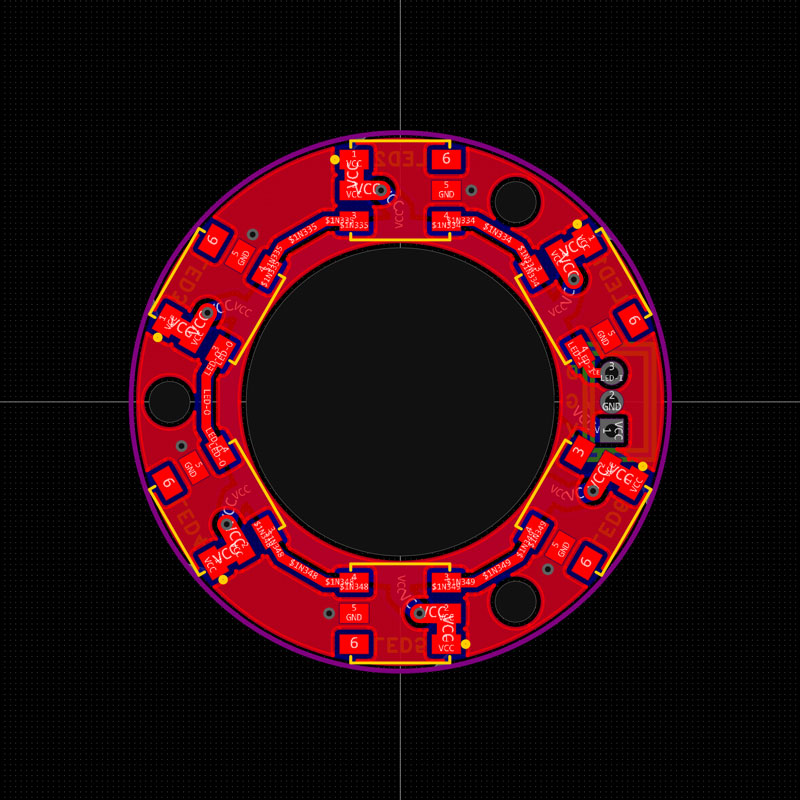
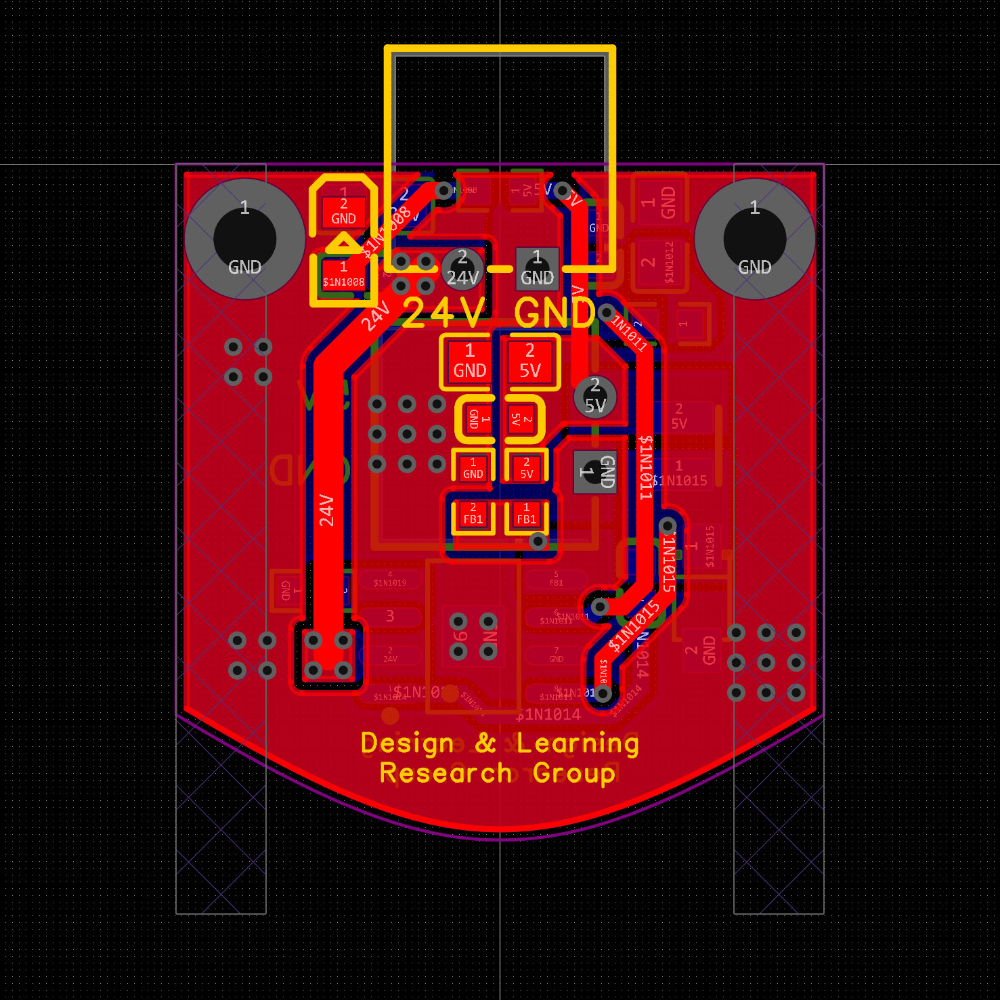

# Assembly Guide

This guide provides instructions on how to assemble the MetaBall.

## 🛠️ Hardware Components

Here is a list of the hardware components required for the MetaBall assembly:

| Component        | Quantity | Specification / Model  | Link                                                                                       |
|------------------|----------|------------------------|--------------------------------------------------------------------------------------------|
| Soft Struture    | 1        | TPU                    | https://www.wenext.com/materials/vacuum-casting/tpu                                        |
| Controller Board | 1        | LicheeRV Nano-W        | https://www.aliexpress.com/item/1005006519668532.html                                      |
| Camera           | 1        | GC4653                 | https://www.aliexpress.com/item/1005006519668532.html                                      |
| Lens             | 1        | 1.8mm 1/4" 5MP         | https://item.taobao.com/item.htm?id=671331312652                                           |
| Power Board      | 1        | FR-4 PCB               | https://drive.google.com/drive/folders/1ZkG2VSxWzBC7wph7RwXa07rj1HjClsA1?usp=drive_link    |
| LED Light Board  | 1        | FR-4 PCB               | https://drive.google.com/drive/folders/1yD8PEcGVPE61CMEFvTqeL_rykpJHFsyy?usp=drive_link    |
| USB Cable        | 1        | Type-C                 | https://www.aliexpress.com/item/1005006434080534.html                                      |
| 3D-Printed Parts | 3        | PLA or ABS             | https://drive.google.com/drive/folders/1sVMEvZ0fE7xA3FavJFJfnwHuXMpaLqHJ?usp=drive_link    |

## 🧩 Assembly Steps

### Step 1: Prepare the Soft Struture

It's recommended to fabricate the soft struture with TPU by vacuum casting, which is provided by [WeNext](https://www.wenext.com/materials/vacuum-casting/tpu). You need to upload the CAD file to their website and order the TPU material with hardness of 90. You can also use other soft materials which have similar properties.

<p align="center">
  
</p>

### Step 2: Prepare the 3D-Printed Parts

The 3D-printed parts can be fabricated using PLA or ABS materials. You can use any 3D printing service or your own 3D printer to print the parts. The CAD files for the 3D-printed parts are available on [Google Drive](https://drive.google.com/drive/folders/1sVMEvZ0fE7xA3FavJFJfnwHuXMpaLqHJ?usp=drive_link), and the assembly preview is available on [Fusion](https://a360.co/4ePH4PC). We also provide a [3mf file](https://makerworld.com/models/2239256-metaball-a-soft-end-of-robot-module) for 3D printers like Bambu Lab X1C.

<p align="center">
  <a href="https://a360.co/4ePH4PC"></a>
  <a href=""></a>
</p>

### Step 3: Prepare the PCBs

The power board and LED light board are designed as FR-4 PCBs. You can use [JLCPCB](https://jlcpcb.com) to fabricate the PCBs. The PCB files are available on [Google Drive](https://drive.google.com/drive/folders/1VPyich8r8H6ijrCqrMxzIe2TUbrFpQG2?usp=drive_link).

<p align="center">
  
  
</p>

### Step 4: Flash the Controller Board

The controller board is [LicheeRV Nano](https://wiki.sipeed.com/hardware/en/lichee/RV_Nano/1_intro.html), a mini-sized development board equipped with the SG2002 processor. The W version of the board supports 2.4G / 5.8G dual-band WiFi6, which is necessary for wireless communication.

You can flash the SD card with [metaball.img](https://drive.google.com/drive/folders/1K3K_dp9mxKrNleex0SsSKON6uSxgWlT2?usp=drive_link) using [balenaEtcher](https://www.balena.io/etcher/). After flashing, insert the SD card into the controller board and connect the board to your computer via USB Type-C cable. You can find the IP address of the board by running the following command:

```bash
arp -a
```

There should be two IP addresses starting with `10.`, both of which are USB virtual network interfaces of the board. You can use either one to connect to the board via SSH, and the default username and password are both `root`. You can also modify the WiFi settings by running the following command after connecting to the board:

```bash
cd /maixapp/apps/metaball/scripts
python wifi_connect.py --ssid <ssid> --pwd <pwd>
```

where `<ssid>` and `<pwd>` are the SSID and password of your WiFi network. Then you can reboot the board and it will connect to the WiFi network automatically.

### Step 5: Assemble the LED Light Board

The LED light board is mounted on the top of the MetaBall base mount with M2 screws. An acrylic cover is also mounted on the top of the LED light board to protect the LEDs.

### Step 6: Assemble the Camera and Controller Board

The camera is mounted inside the MetaBall base mount with M2 screws after replacing the lens with a 1.8mm 1/4" lens which provides a wide field of view (FOV). The camera is connected to the controller board via a FPC cable. The len will go through the hole on the top of the MetaBall base mount. Note that it's necessary to adjust the lens position by screwing it to ensure the camera can capture the marker clearly.

### Step 7: Calibrate the Camera

After assembling the camera and controller board, you need to calibrate the camera's intrinsic parameters, including camera matrix and distortion coefficients. You can use the [camera calibration script](../scripts/calibrate_camera.py) to calibrate the camera by running the following command after connecting the camera to the host computer:

```bash
python scripts/calibrate_camera.py --name <name> --host <host>
```

where `<name>` is the name of the camera and `<host>` is the IP address of the controller board. You will see a OpenCV window showing the camera images, and you can press `c` to capture images and `ESC` to exit. Images are saved in `data/camera_calibration` directory. Then the script will ask you whether to use OpenCV or MATLAB for calibration. For OpenCV, the script will automatically calculate and save the parameters beside the images. For MATLAB, you need to run the `Camera Calibration` app in MATLAB and load the images to calibrate the camera. After calibration, you can use `scripts/calib2yaml.m` to save the parameters in a YAML file.

### Step 8: Assemble Other Components

The power board is mounted beside the controller board with M2 screws. The power board is connected to `VBUS` and `GND` pins of the controller board with a 2-pin XH JST connector. The power board supports 6-36V DC input also through a 2-pin XH JST connector.

The LED light board is connected to `VBUS`, `SPI4_MOSI (A25)` and `GND` pins of the controller board with a 3-pin ZH JST connector. The controller board sends SPI commands to the LED light board to control the brightness and color of the WS2813B LEDs.

The bottom frame is mounted on the bottom of the base mount with M2 screws. You can add mounting structures on it to mount the MetaBall on robot or other platforms.

The soft structure is mounted on the top of the base mount with M3 screws. The marker is attached to the top of the soft structure with a 3D-printed part. You can generate ArUco DICT_4X4 marker from [tagsgen.top](https://tagsgen.top/) and print it.

### Step 9: Modify the Configuration

After assembling the MetaBall, you need to modify the configuration files in `configs/` directory. There are two `yaml` files needed to be modified:

- `metaball.yaml`: This file is the main configuration file for the MetaBall, containing the path to the camera configuration file, and the path to the BallNet onnx model.
- `camera.yaml`: This file contains the camera intrinsic parameters, including camera matrix and distortion coefficients.

You can follow the example files in `configs_example/` directory to modify the configuration files.
